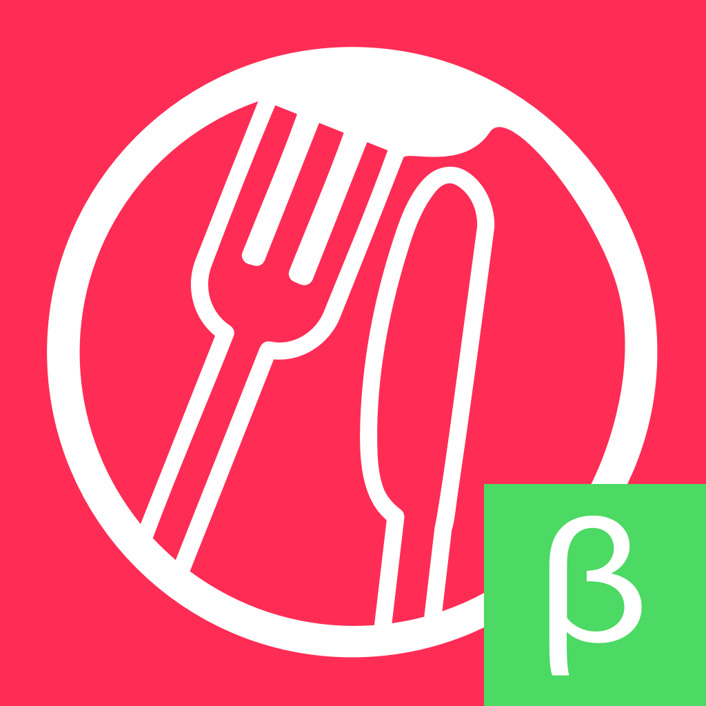
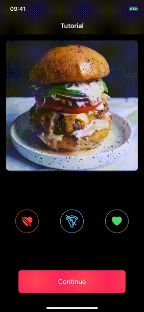

<!-- <table align="center"><tr><td align="center" width="9999"> -->

# Cena Swiper

A simple iOS app to label food images. It was used to label a food dataset which
was later used to train a food classifier.

## Demo

## Credits

This software uses the following open source packages:

- [Koloda](https://github.com/Yalantis/Koloda)
- [TransitionButton](https://github.com/AladinWay/TransitionButton)
- [Kingfisher](https://github.com/onevcat/Kingfisher)
- [Instructions](https://github.com/ephread/Instructions)
- [JWTDecode](https://github.com/auth0/JWTDecode.swift)
- [ReachabilitySwift](https://github.com/ashleymills/Reachability.swift)
- [ActiveLabel](https://github.com/optonaut/ActiveLabel.swift)
- [PromiseKit](https://github.com/mxcl/PromiseKit)
- [UICircularProgressRing](https://github.com/luispadron/UICircularProgressRing)
- [SwiftEntryKit](https://github.com/huri000/SwiftEntryKit)
- [LTMorphingLabel](ltmorphinglabel)

---

## Contact
> Thibault Gagnaux • <thibault@gagnaux.ch>